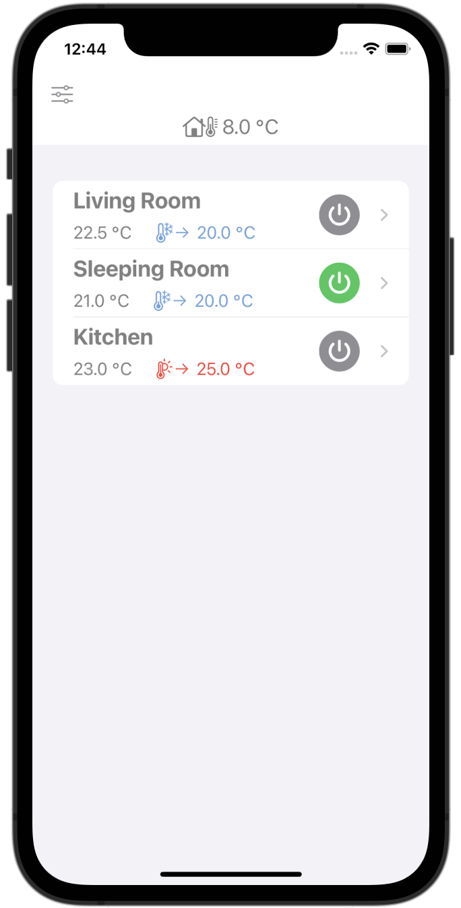
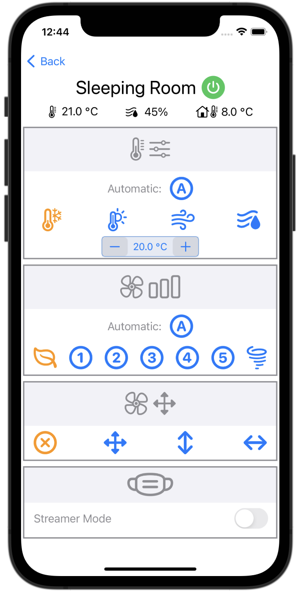
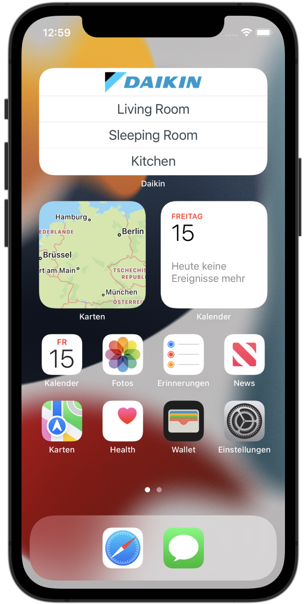

# DaikinController
- *Not* official by Daikin
- work in progress

iOS and macOS app to control Daikin air conditioning units. The macOS version is fundamentally working, but the focus lies on the iOS version.

The official daikin app has an extensive feature set, looks nice and is reliable.

The main drawback of the official app is that it takes some time to connect with the devices: 
- launch screen with loading time
- sometimes enter email+password to login 
- some features are accessible via sub menus
- no widgets available for fast access to an AC
 
The main purpose of this app is to get quick and easy access to the ACs for the most important features like power on/off, change mode or temperature change.

The app launches directly with the list of available ACs, power on/off is availabe in the list:

Control screen for a device when selected from the list:

With the widgets you can directly go to a specific device, skipping the choice in the AC list. 

Tested with device FTXA-AW, stylish, FW 1.14.48 and 1.14.58
but should work with most Daikin air conditioning units.
There are some features for which you will the official app, e.g. FW update.

